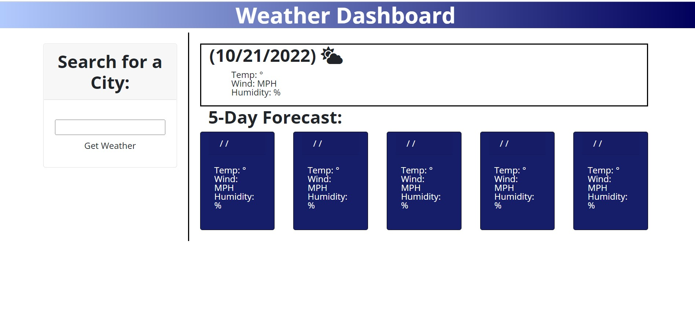

# Weather-Dashboard

## Description
This app allows users to enter view weather forecasts for a city they enter into the search field. For the selected city, the app will display the city's current temperature, wind, humidity, and UV index, as well as the 5-day forecast from the [Open Weather](https://openweathermap.org/forecast5) API. When the user searches for another city, the app will create a button labled with the prevoius city's name, so that users can easily retrieve that city's forecast again by clicking the button. 

Here is a link to the [deployed page.](https://abi-queen.github.io/Weather-Dashboard/)

## Instructions
To use this app, open the [deployed page.](https://abi-queen.github.io/Weather-Dashboard/). Enter a city in the search field at the left. Your city's forecast will be displayed to the right. Enter a new city in the search field. Your prevoius searches will be saved in a list under the search field. Do re-display these previous searches, click on the saved city name. 

## Contributors
I built this app with HTML, CSS, Markdown, and JavaScript. It uses the Bootstrap, Font Awesome, JQuery, and Moment.js cdn libraries. I also referred to the following resources:
- The 5-Day weather forecast API at Open Weather](https://openweathermap.org/forecast5) 
- UC Davis Bootcamp Modules 5 and 6 (2022)
- ['How to Use API Keys', Full Stack Blog](https://coding-boot-camp.github.io/full-stack/apis/how-to-use-api-keys)
- [Bootstrap documentation](https://getbootstrap.com/docs/4.0/layout/grid/)
- [JQuery documentation](https://api.jquery.com/)
- [W3 Schools tutorial on HTML symbols](https://www.w3schools.com/html/html_symbols.asp)
- [W3 Schools tutorial on HTML weather icons](https://www.w3schools.com/icons/fontawesome5_icons_weather.asp) 